# 高校毕业生就业服务平台

#### 介绍
基于SpringBoot+Vue实现的高校毕业生就业服务平台，本系统前后端分离，包含web端、管理员端、学生端、企业端，功能非常完善，代码规范整洁，运行简单，适合毕业设计以及高校就业平台搭建。

#### 联系/演示地址
 [点击获取联系/演示地址](https://www.xunmaw.com/ "点击获取更多") 

 
#### 软件架构
前端：vue | element-ui  
后端：springboot | mybatis  
环境：mysql | jdk1.8 | maven | node | redis      

#### 功能介绍
##### 【代码结构与数据库截图】
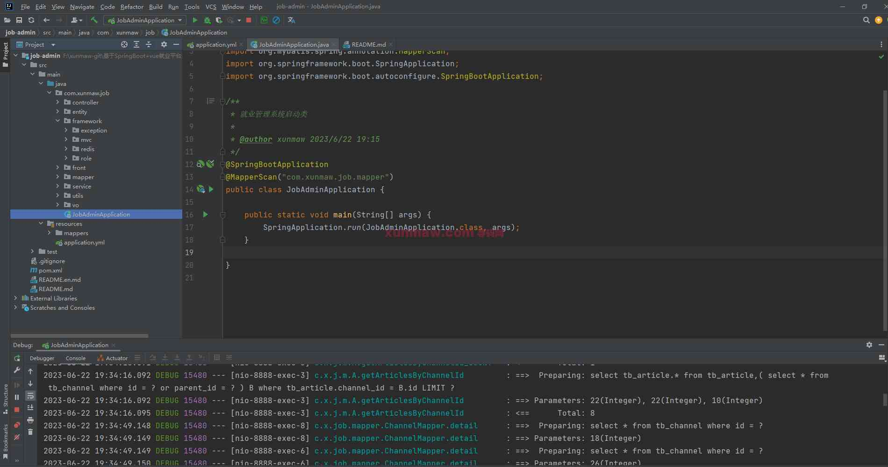 
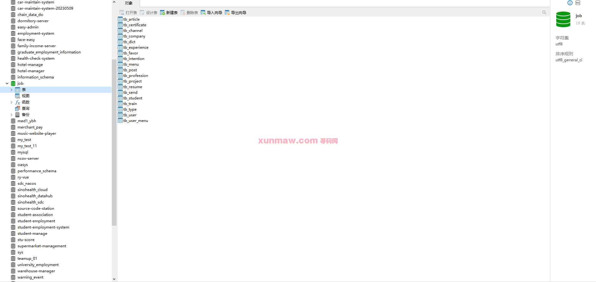  

##### 【功能详述】 
1. 首页  
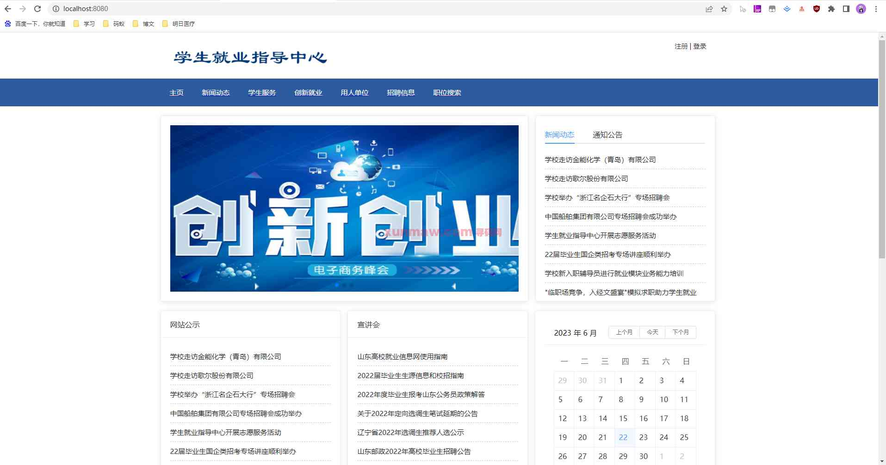

2. 登录页  
登录页分三个角色：管理员、学生、企业  
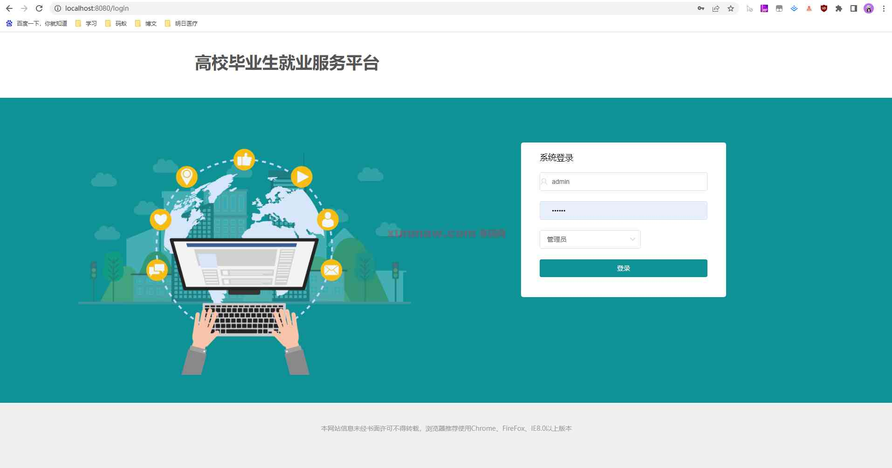

3. 管理员-首页  

4. 管理员-用户管理  
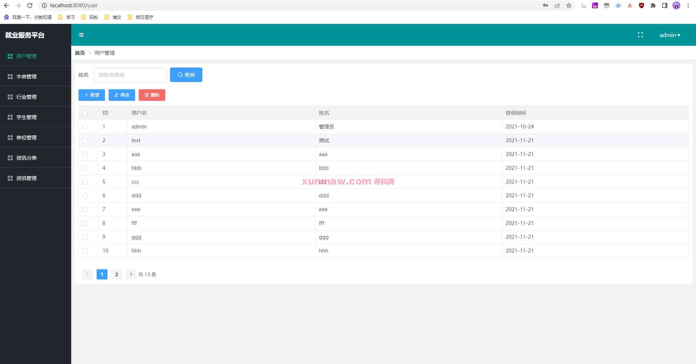

5. 管理员-字典管理  
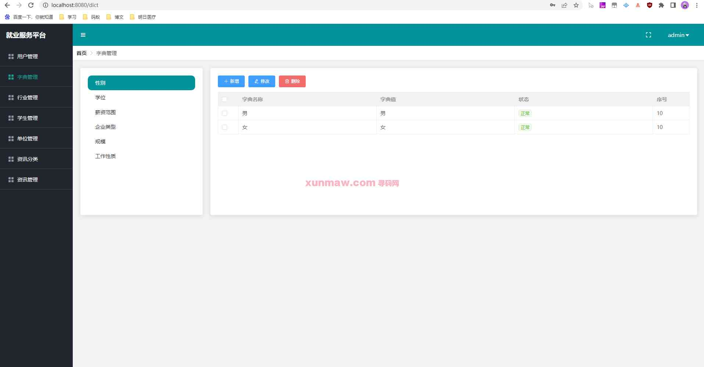

6. 管理员-行业管理  
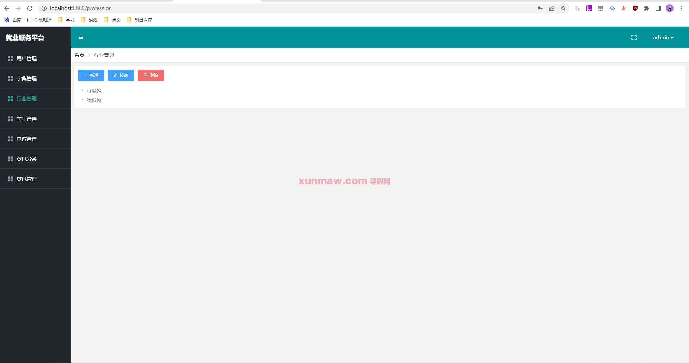

7. 管理员-学生管理  
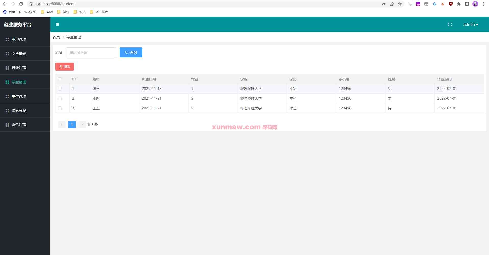

8. 管理员-单位管理  
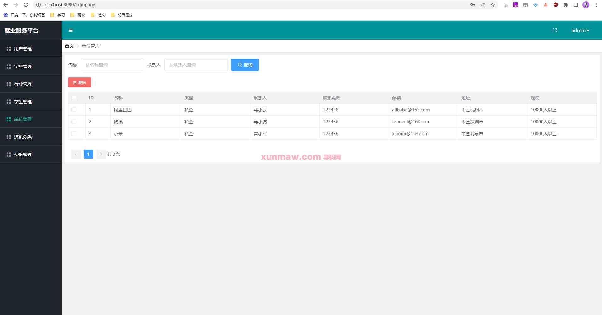

9. 管理员-资讯分类管理  
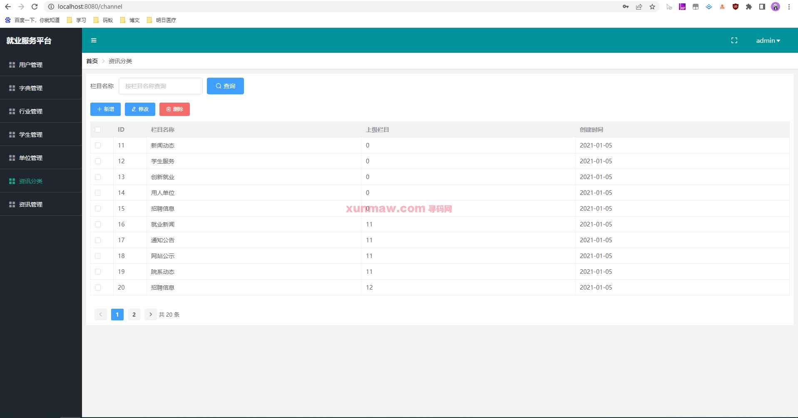

10. 管理员-资讯管理  
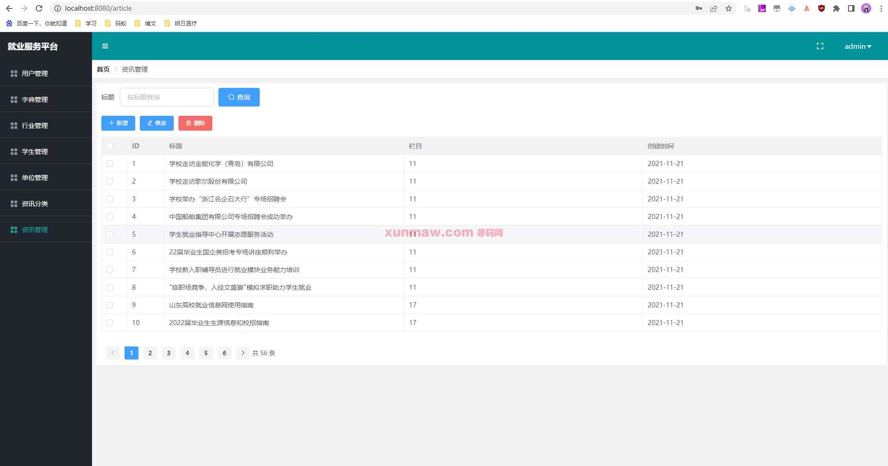

11. 企业端-基本信息  
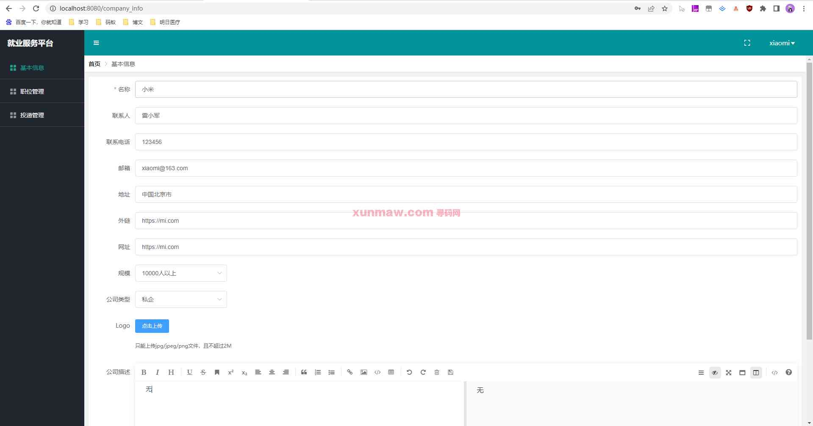

12. 企业端-职位管理  
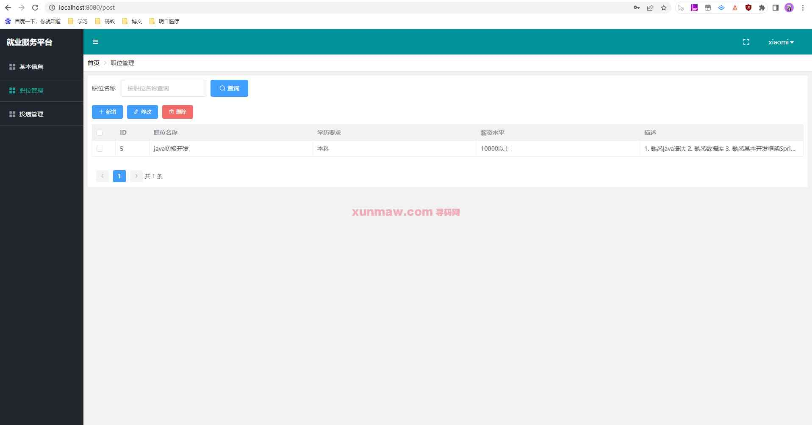

13. 企业端-投递管理  
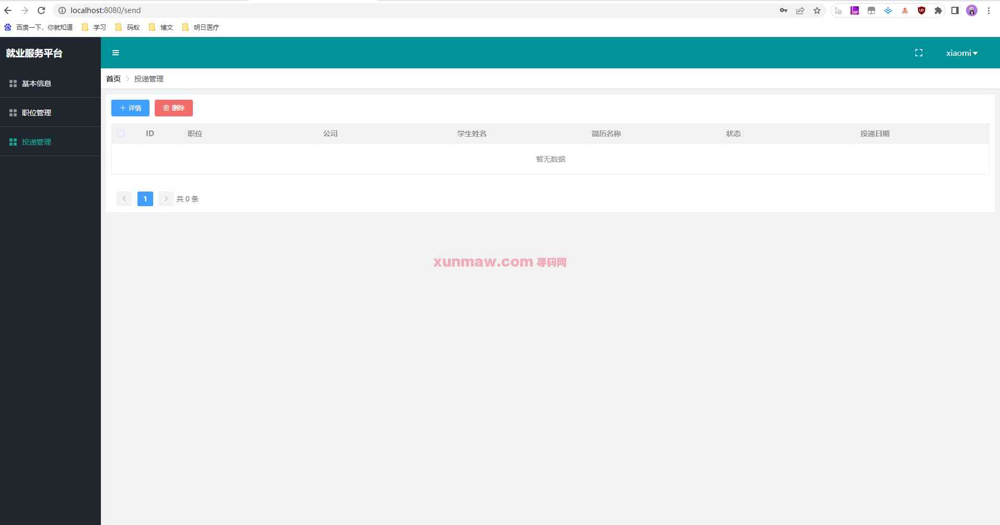

14. 学生端-基本信息  
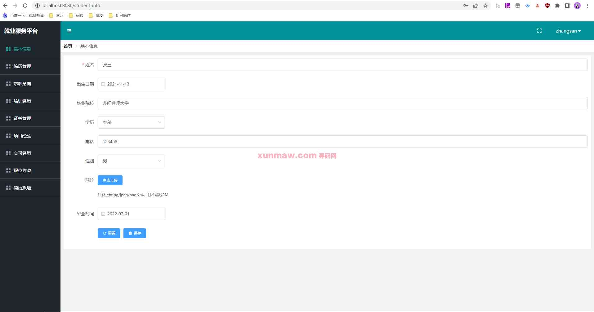

15. 学生端-简历管理  

16. 学生端-求职意向  
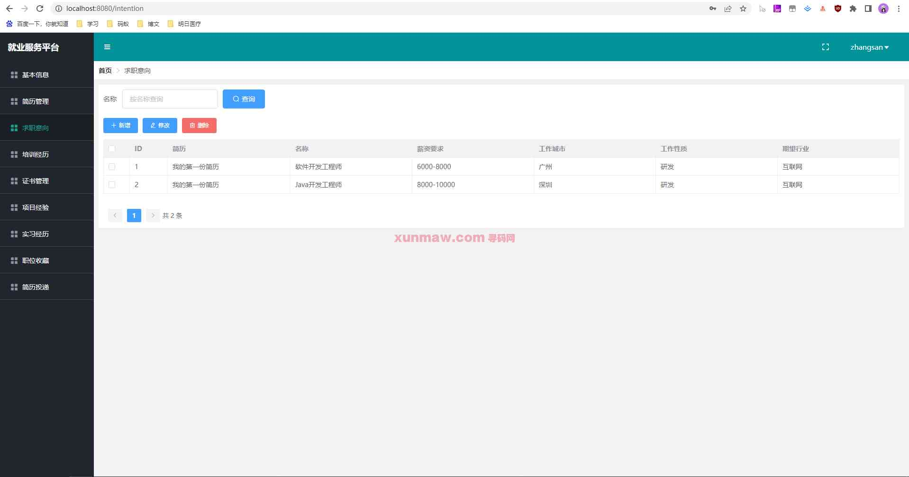

17. 学生端-培训经历  
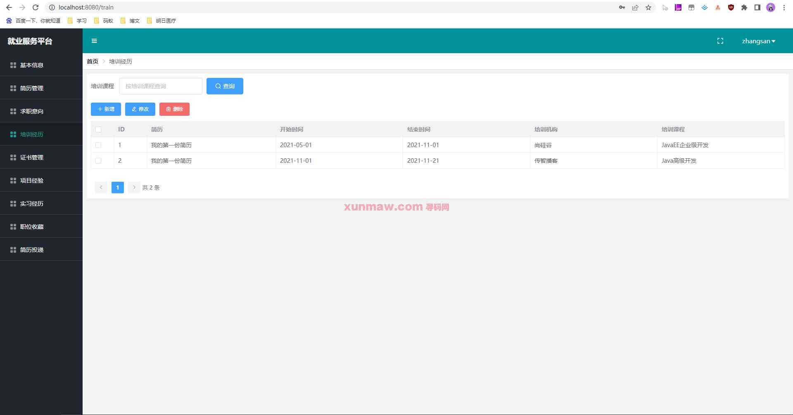

18. 学生端-证书管理  
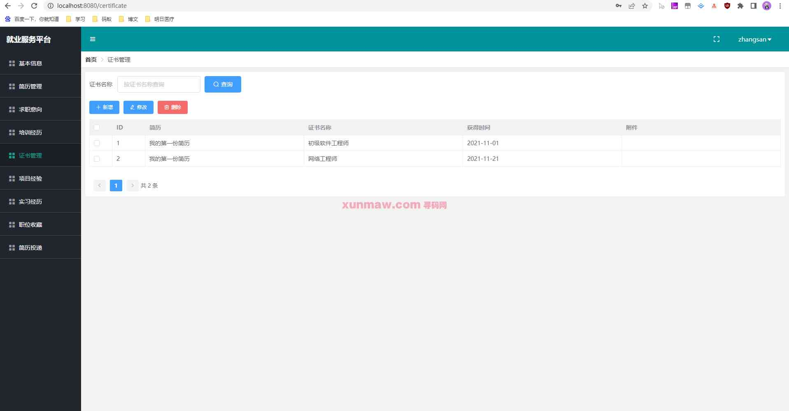

19. 学生端-项目经验  
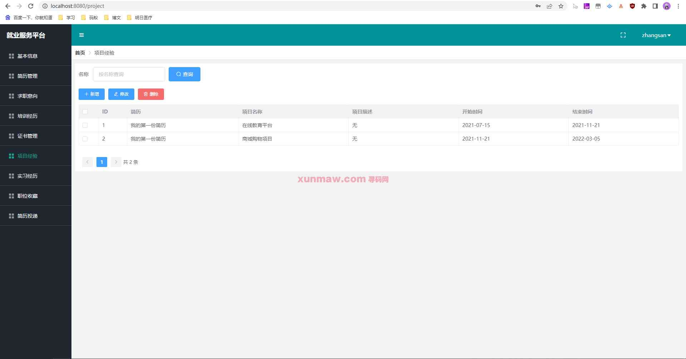

20. 学生端-实习经历  

21. 学生端-简历投递  

22. 学生端-职位收藏  
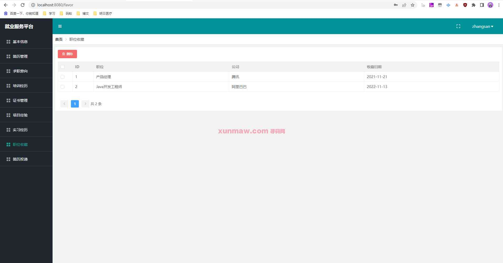

#### 项目预览
地址：[商品详情 ](https://www.xunmaw.com/shop/detail/1673350059636314113)     
点击商品详情中的演示地址，看查看系统录制的视频    

#### 使用说明
1. 创建数据库，执行数据库脚本  
2. 修改jdbc数据库连接参数  
3. 下载安装maven依赖jar  
4. 启动SpringBoot启动类  

后端管理：   
    请求地址： http://localhost:8080   
    用户名：admin      
    密码：123456      
    
#### 联系作者
这是作者的微信二维码，如需本项目源代码，可扫码联系联系作者  

这是作者的公众号二维码，时不时会推一些新开发的项目源码与高效软件工具，感兴趣的朋友给个关注  
 获取源码 联系微信：xunmaw001
